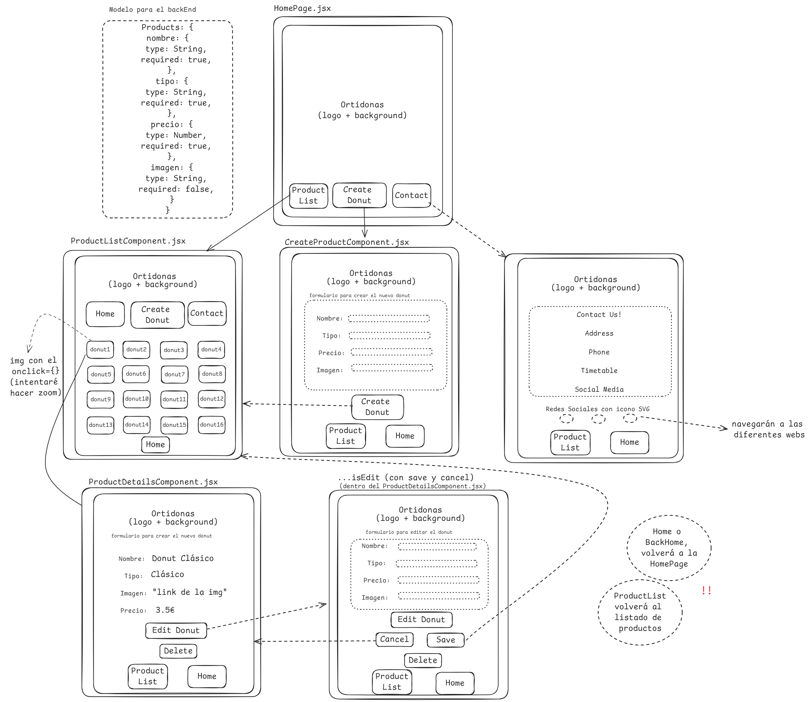

# **ORTIDONAS STORE**:

Para poder crear una Tienda de Donuts funcional he tenido que crear una estructura de Back y Front, para crear un dinamismo entre los elementos y un fácil acceso a los usuarios.

**Funcionalidades de la aplicación**: Encontraremos una app con diferentes paginas como la de Crear productos, Contacto, HomePage o Detalles de los productos.

Todo el proyecto del front estará relacionado con una base de datos creada en **MongoDB** (**Atlas**) para el mejor manejo de la misma.

En este proyecto trabajaremos con los diferentes lenguajes: **React**, **Redux**, **Hooks de React**, **JavaScript**, **HTML**, **CSS5**, **MongoDB**.

### **BACKEND** ->

Lo primero fue la creación de una **base de datos** con la que trabajar. Para ello creé un **modelo** el cual seguir, siguiendo las caracteristicas de "_nombre_", "_tipo_", "_precio_" e "_imagen_" (todas requeridas para la creación a excepción de la imagen).

Creación de un **controlador** de productos donde organizaremos los EndPoints de nuestra applicacion, ya sea la creacion de un producto (**POST**), obtención de un producto por id o todo el listado de los productos (**GET**), edición de un producto (**PATCH**) y la eliminacion del mismo (**DELETE**). También la creación de un **routes** para poder enrutar todo acorde a lo que trabajamos. Todas los endpoints fueron comprobados previamente con ThunderClient (visualStudioCode), incluyendo manejadores de errores.

El puerto donde trabajaremos en el backend será el 8000. [localhost:](http://localhost:8000/products)

Las dependencias instaladas en el back seran estas:

- npm init -y
- npm i cors
- npm i express
- npm i mongoose
- npm install -save-dev nodemoon
- npm i dotenv
- npm i bcrypt (por si crearamos algun login a futuro)
- npm i jsonwebtoken (por si crearamos algun login a futuro)

Crearemos un archivo .gitignore que contendrá -> /node_modules y el .env (a futuro)

Para arrancar el servicio en el back lo haremos con un:

- npm run start

### **FRONT** ->

Creación de un esquema en excalidraw para una mejor visualización de las funcionalidades del proyecto.

En cuanto al Front trabajaremos con React principalmente. El proyecto se crea con un primer **npm create vite@latest "..."**. Tras la creacion del back, podemos trabajar en el front para ir dandole "vida" a nuestras funcionalidades.

Crearemos los **componentes** donde se realizaran todas las acciones de nuestra aplicación, ya sea conexión con otros componentes atómicos, reducers y actions. Tambien estuve navegando para averiguar la forma de incluir SVG's en REACT, no encontre otra forma que creando un componente con su css correspondiente y luego importandolo atomicamente donde yo quisiera utilizarlo (en este caso en el ContactPage.jsx para las redes sociales creadas).

También tendremos las **pages** para poder atomizar aun más nuestra aplicación. Nada mas acceder entraremos en la HomePage, desde donde tendremos acceso a todas las funcionalidades de nuestra aplicacion navegando gracias al router.

Conseguiremos esa conexión con el backend gracas a los fetch que realizaremos para obtener los endpoints en nuestra aplicación.

En cuanto a los estilos, encontraremos algunos en linea (intenté que hubiera los menos posibles, pero por falta de tiempo alguno que otro se quedó) y los demas trabajados directamente desde el **index.css** ya que serán estilos globales y no he visto necesario crear un css para cada componente (aunque se que sería lo ideal).

Las dependencias instaladas en el front son:

- npm i
- npm install redux react-redux
- npm install --save react-router-dom

Para arrancar el servicio en el front lo haremos con un:

- npm run dev

 

## ¡RECORDATORIO! Para iniciar ambos proyectos (front y back) debes realizar un:

- **npm i** (al iniciar ambos proyectos)

 

#### **HÉCTOR MARISCAL MANZANO**

_Email de contacto_: mariscalmanzanohector@gmail.com
